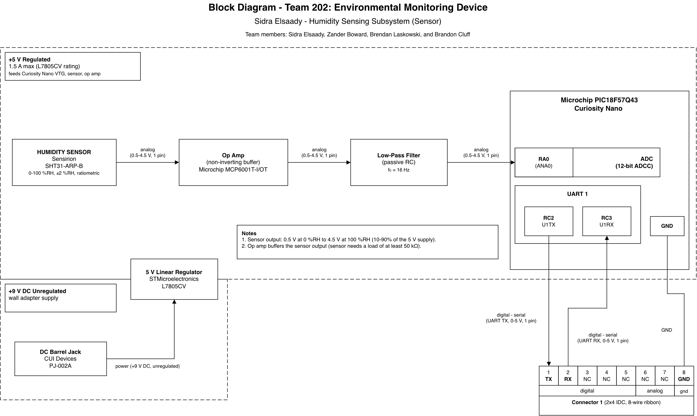

## Overview
This page shows the block diagram for my subsystem on Team 202's Environmental Monitoring Device. My board measures relative humidity and sends the reading to Zander Boward's hub board, which shows it on the LCD.

* **Power levels:** A 9 V DC wall adapter powers the board through a barrel jack. An STMicroelectronics L7805CV linear regulator steps this down to a regulated 5 V (1.5 A max), which powers the Curiosity Nano, the humidity sensor, and the op amp.
* **Sensor:** A Sensirion SHT31-ARP-B humidity sensor outputs an analog voltage from 0.5 V (0 %RH) to 4.5 V (100 %RH). The signal passes through an op amp buffer (Microchip MCP6001T-I/OT) and a passive RC low-pass filter (fc ≈ 16 Hz) before reaching the ADC on pin RA0 of the PIC18F57Q43.
* **Actuator:** None. This subsystem is sensing only.
* **Team connections:** Connector 1 (2x4 IDC, 8-wire ribbon cable) connects to Zander's hub board. Pin 1 sends humidity data to the hub (UART TX, RC2), pin 2 receives data from the hub (UART RX, RC3), pin 8 is ground, and pins 3-7 are not connected.
* **Power source:** 9 V DC wall adapter through a CUI Devices PJ-002A barrel jack.

## Block Diagram

[Download the draw.io source file](sidra_block_diagram.drawio)
